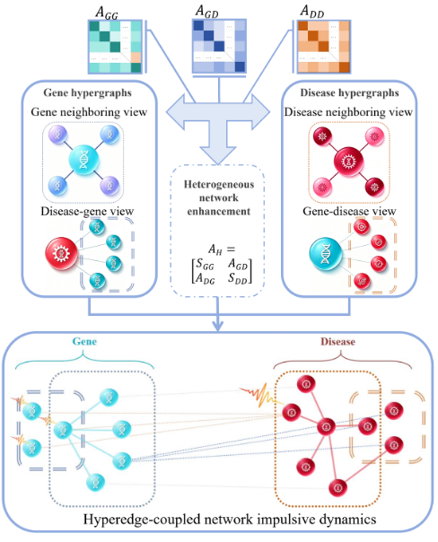

# HyHNID: Hypergraph-coupled heterogeneous network impulsive dynamics for predicting disease-related genes

Identifying disease-associated genes accurately is essential for exploring disease mechanisms and precision medicine. Most traditional network-based methods only capture pairwise interactions between biological nodes, ignoring their high-order synergistic relationships, resulting in unsatisfactory prediction performance. Therefore, this study proposes a novel computational method based on hypergraph-coupled heterogeneous network impulsive dynamics (HyHNID) for disease gene prediction. It first constructs four types of multi-view hyperedges based on biological networks of genes and diseases, and a cross-layer similarity calculation strategy is used to optimize network topology and reduce structural noises. Unlike conventional methods that rely solely on pairwise diffusion, HyHNID builds a high-order coupled dynamic system by integrating four types of hyperedge-coupling dynamics into network impulsive dynamical equations of genes and diseases, respectively. This system can simultaneously extract basic pairwise features and high-order synergistic features but also realize the cross-layer signal propagation in heterogeneous biological networks. We conduct comprehensive evaluations including five-fold cross-validation, novel disease testing and independent testing. Experimental results substantiate the positive contributions of hyperedge-coupling dynamics and demonstrate that HyHNID outperforms both pairwise diffusion models and other state-of-the-art algorithms. Consequently, the proposed method offers an effective and robust framework for disease-gene prediction and helps better understand the synergistic regulation of complex biological networks. 

  

## Requirements
Matlab 2016 or above   

## Codes 
#main_HyHNID.m: cross-validation code.   
This code allows parallel execution.    
  
#A_HyHNID.m: the recommended algorithm in the study.  
% Input:   
% AdjGfG: associatins between Genes (G) and Genes (G)    
% AdjGfD: associatins between Genes (G) and Diseases (D)   
% AdjDfD: associatins between Diseases (D) and Diseases (G)   
% P0_G: initials in Gene network   
% P0_D: initials in Disease network    
% Ouput:  
% TableScores: a table whos variable record the scores of genes.  
  

## Dataset 
This dataset includes:  
 disease-gene associations, disease-disease associations and gene-gene associations.   
 

## Results 
The results will be automatically saved into the directory: results.  

 

 
